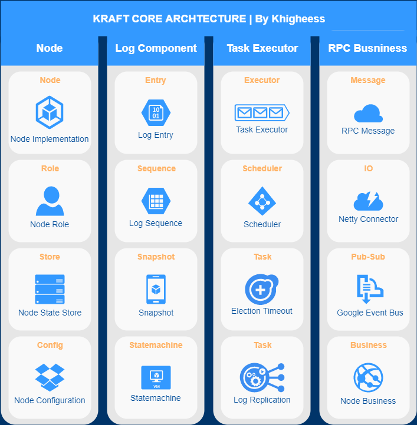

# kraft

A distributed KV based on [raft](https://raft.github.io/raft.pdf) protocol.

## Completed Feature

- [x] leader election
- [x] append log entry
- [x] generate log snapshot
- [x] group member change
- [x] kv server and client
- [ ] prevote rpc
- [ ] log batch transfer and pipelining
- [ ] leadership transfer
- [ ] multi-raft
- [ ] transaction support

## Core Architecture

## Mit License

Khighness's kraft is open-sourced system licensed under the [MIT license](https://github.com/Khighness/kraft/blob/master/LICENSE).
